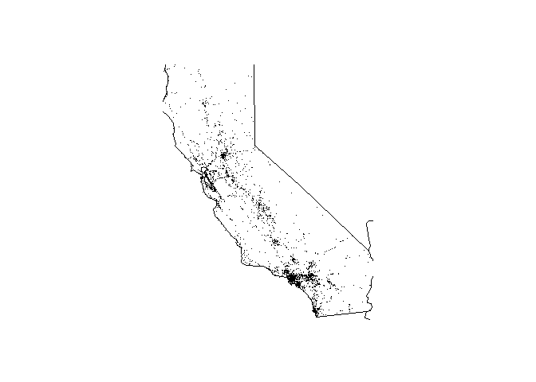

<!-- README.md is generated from README.Rmd. Please edit that file -->
FARS
====

FARS has been developed in a context of the Coursera's course "[Building an R Package](https://www.coursera.org/learn/r-packages/home/welcome)". The package provides a few very basic functions, which work on top of embedded in the package sample FARS data (for more information about FARS data please see [Fatality Analysis Reporting System](https://www.nhtsa.gov/research-data/fatality-analysis-reporting-system-fars)).

Installation
------------

You can install FARS from github with:

``` r
# install.packages("devtools")
devtools::install_github("Valentin-Konoshenko/FARS")
```

Usage
-----

It probably makes sense to start analysis FARS data from exprloring the big picture. It is where `fars_summarize_years` comes into play.

``` r
## exploring summarized data

FARS::fars_summarize_years(2013:2015)
#> # A tibble: 12 x 4
#>    MONTH `2013` `2014` `2015`
#>  * <int>  <int>  <int>  <int>
#>  1     1   2230   2168   2368
#>  2     2   1952   1893   1968
#>  3     3   2356   2245   2385
#>  4     4   2300   2308   2430
#>  5     5   2532   2596   2847
#>  6     6   2692   2583   2765
#>  7     7   2660   2696   2998
#>  8     8   2899   2800   3016
#>  9     9   2741   2618   2865
#> 10    10   2768   2831   3019
#> 11    11   2615   2714   2724
#> 12    12   2457   2604   2781
```

You can focus on a specific state and a year and plot the accidents on a map using `fars_map_state`:

``` r
## plotting the accidents on a map

FARS::fars_map_state(6, 2015)
```



The `fars_read` function will be useful if you want to work with raw data directly. For instanse let's find out the least and the most dangerous hours

``` r
## the least and the most dangerous hours

library(dplyr)
#> 
#> Attaching package: 'dplyr'
#> The following objects are masked from 'package:stats':
#> 
#>     filter, lag
#> The following objects are masked from 'package:base':
#> 
#>     intersect, setdiff, setequal, union

data_file <- FARS::make_filename(2015)
summarized_data <- FARS::fars_read(data_file) %>%
  filter(HOUR != 99) %>%
  group_by(HOUR) %>% 
  summarise(number_of_cases = n()) %>%
  arrange(number_of_cases)
d <- summarized_data[c(1, nrow(summarized_data)), ]
cat("\nThe least dangerous hour:", unlist(d[1, "HOUR"]), 
    "\nThe most dangerous hour: ", unlist(d[2, "HOUR"]))
#> 
#> The least dangerous hour: 4 
#> The most dangerous hour:  18
```
